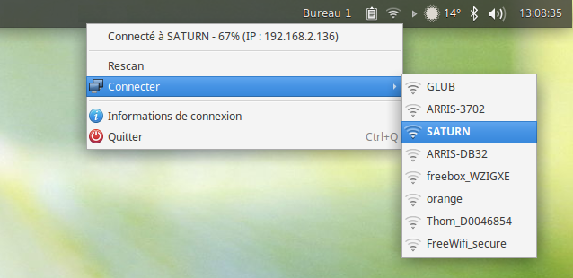

# Elementary Wicd Icons

## Requirements

* ``ruby >= 2.0`` (no gem required)
* ``wicd-gtk >= 1.7``

## Install

Simple install:

~~~~
# sudo ./install
# sudo ./install dark
# sudo ./install light
~~~~

Default theme is ``light``.
