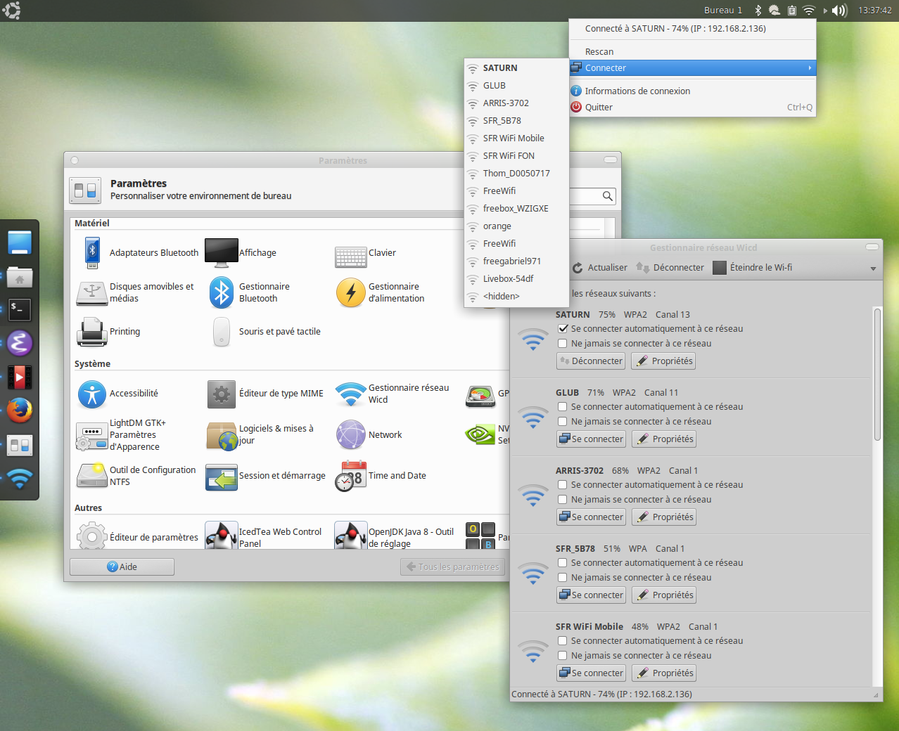

# Elementary Wicd Icons

Full replacement, inluding two ``flavours`` (``light`` and ``dark``) for
panel systray icons, ``xfce4-settings-manager`` integration and
``hicolor`` replacement icons. Providing a complete and consistent
experience for any desktop environment
based on [``elementary/icons``](https://github.com/elementary/icons).

## Install

This ``install`` script + icons target ``wicd-gtk >= 1.7``
and require ``ruby >= 2.0``.

Simple install:

~~~~
# git clone https://github.com/SwagDevOps/elementary-wicd-icons elementary-wicd-icons
# cd !$
# sudo ./install
~~~~

Default theme is ``light`` (as seen on screenshot):

~~~~
# sudo ./install dark
# sudo ./install light
~~~~

## License

Based on the icons from :

* [Wicd Elementary Theme](http://xfce-look.cp1.hive01.com/content/show.php/Wicd+Elementary+Theme?content=168050)
* [Named, vector icons for elementary OS](https://github.com/elementary/icons)

both licensed under a [GNU General Public License](https://www.gnu.org/licenses/gpl.html)
